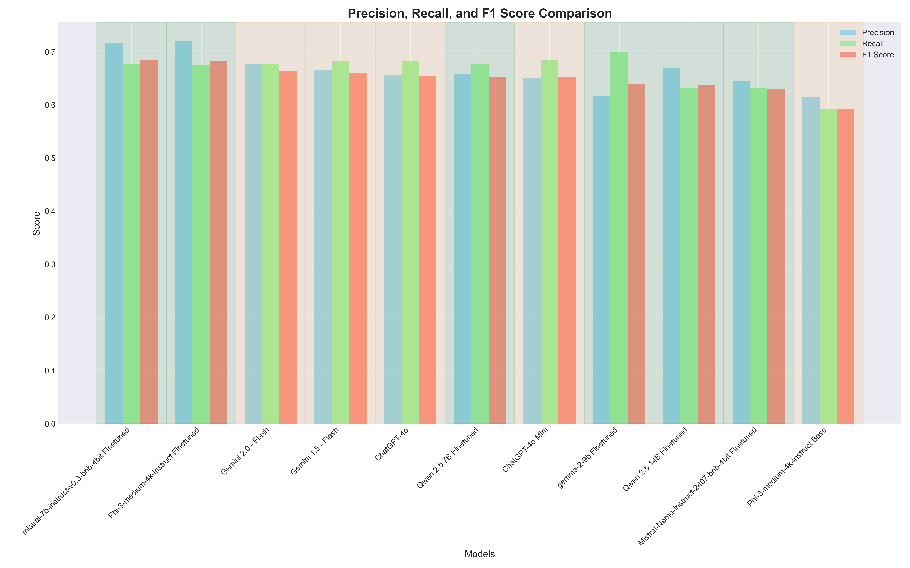
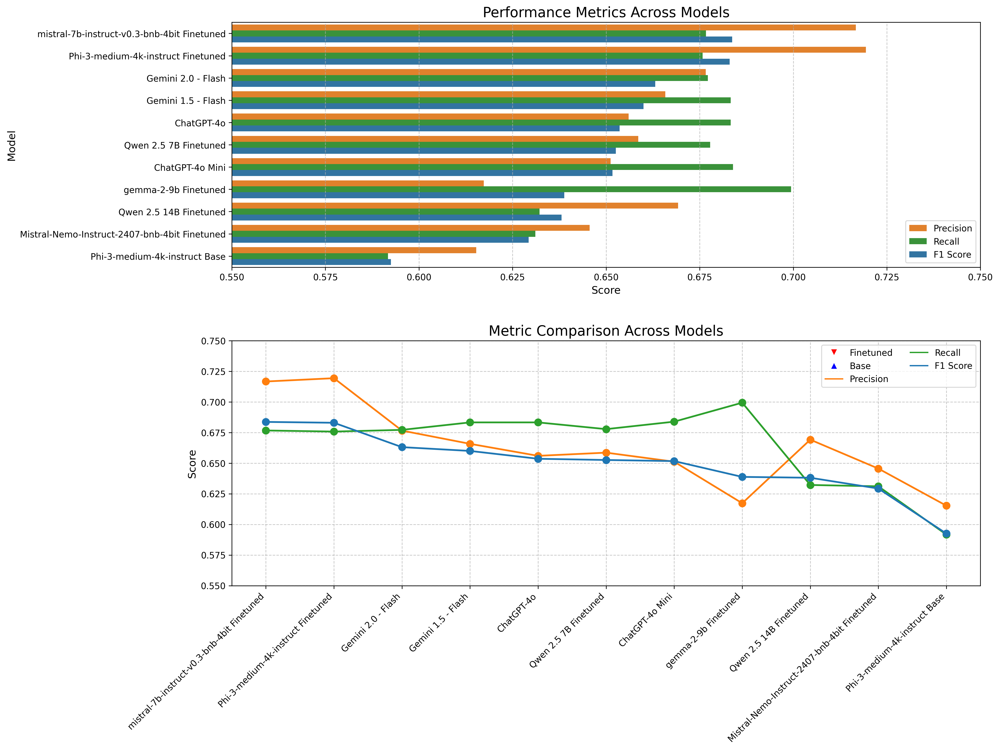
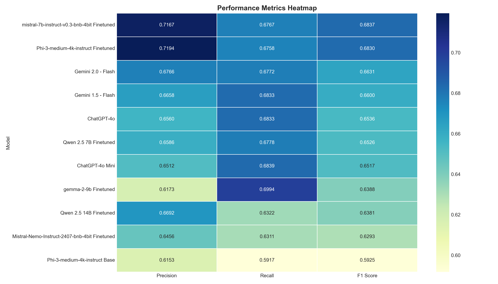
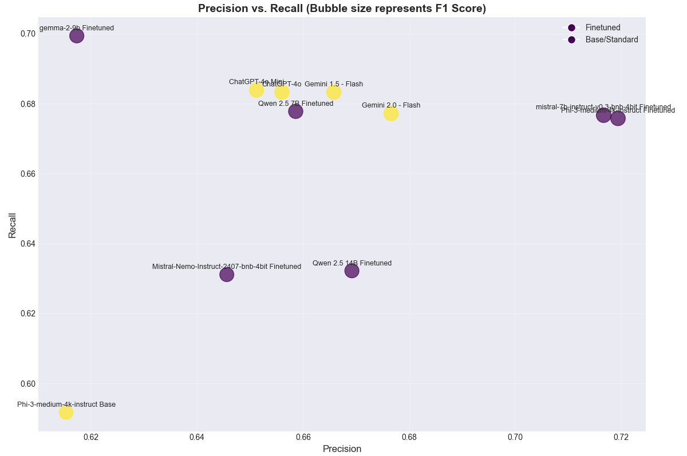

# Fine-tuning Small LLMs to Outperform Large Models on Specific Tasks

[](https://medium.com/@subhashbs36/fine-tuning-small-llms-to-outperform-gpt-scale-giants-on-domain-specific-tasks-23325c328aea)
[](https://www.linkedin.com/posts/subhash-b-s_llm-finetuning-mistral-activity-7318408395353403393-A0O8?utm_source=share&utm_medium=member_desktop&rcm=ACoAAB6zPFMBq94dHRCrQiSY5eewRozi3DQzZhs)

## Overview

This repository contains resources and code for fine-tuning smaller language models to outperform larger models on domain-specific tasks.

## 🧠 Fine-Tuning a Domain-Specific LLM that Outperformed GPT-4o & Gemini

This project explores how smaller, fine-tuned Language Models (LLMs) can outperform massive general-purpose models like **GPT-4o** and **Gemini** on **domain-specific tasks**. In this case, the task was to **identify missing key points** in answers generated from long-form content — a challenge where precision and contextual understanding are vital.

Instead of relying on brute-force parameter counts, this project leverages **LoRA-based fine-tuning** and **domain-specific data** to boost performance in a task where large models often return vague or incomplete responses.

---

## 🌟 Problem Statement

Given an answer generated from a long paragraph, the goal is to **evaluate whether all required key points are present**, and if not, identify the **missing ones**. This task is critical in domains like:
- Education: Evaluating student answers.
- Legal: Ensuring contract completeness.
- Medical: Validating report summaries.

### 🔍 Example
**Paragraph (excerpt):**
> Air pollution has a wide range of health impacts including chronic bronchitis, heart disease, and eye irritation. Global studies have conclusively shown these effects even at sub-toxic levels...

**Key Points:**
- Chronic bronchitis is a major health effect.
- Air pollution impacts are proven by global studies.
- Eye irritation occurs due to particulates.
- Sub-toxic levels are still dangerous.

**Answer:**
> Air pollution causes chronic bronchitis and is harmful even at low levels. Global studies support this.

**Expected Output:**
```json
{
  "Points_Missed": ["Eye irritation occurs due to particulates"]
}
```

---

### 📌 Project Highlights
- 📔 Explore the dataset creation in [`Dataset/dataset_creation.ipynb`](Dataset_creation/Dataset_cration.ipynb)
- 🔧 Fine-tuning notebook is available at [`Training/finetune.ipynb`](Finetuning/Finetune.ipynb)
- 🧪 Evaluation notebook can be found at [`Evaluation/evaluate.ipynb`](Evaluate/Evaluate.ipynb)
- 🚀 Fine-tuned using the **LoRA technique** on a domain-specific dataset.
- 📊 Outperformed GPT-4o and Gemini on precision, recall, and F1-score.
- 📁 Includes **dataset creation**, **training**, and **evaluation** pipeline.
- 🔍 Focused on identifying **missing key points** from generated answers.

---

## 🗂️ Project Structure
```bash
.
├── Dataset/
│   ├── your_dataset.csv              # Original dataset with paragraphs
│   ├── output.json                   # Generated QA pairs with missing key points
│   ├── formatted_train_data.json     # Alpaca-style training data
├── Training/
│   ├── finetune.ipynb                # Fine-tuning using Unsloth & LoRA
├── Evaluation/
│   ├── evaluate.ipynb                # Custom evaluation pipeline
├── Results/
│   ├── *.png                         # Performance visualization images
```

---

## 🧾 Dataset Creation

The base dataset was sourced from the [Stanford Question Answering Dataset (SQuAD)](https://www.kaggle.com/datasets/stanfordu/stanford-question-answering-dataset).


We used **OpenAI GPT-4o via Azure** to synthetically generate QA pairs from long paragraphs:
- Extracted 2–5 key points from a paragraph.
- Randomly removed 1–4 key points to simulate incomplete answers.
- Generated JSON in the format:

```json
{
  "Answer": "paragraph with missing key points",
  "key_points": ["point1", "point2"],
  "PointsMissed": ["missing_point1"]
}
```

These were converted to **Alpaca-style prompts** for training.

---

## ⚙️ Fine-Tuning Pipeline

- Used **[Unsloth](https://github.com/unslothai/unsloth)** for efficient LoRA fine-tuning.
- Trained on **formatted Alpaca-style prompts** with 300+ examples.
- Model used: `Meta-Llama-3.1-8B`
- Training config:
  - Batch Size: 2
  - Epochs: 1
  - Optimizer: `adamw_8bit`
  - Sequence Length: 2048
  - LoRA rank: 16

---

## 🥪 Evaluation

The model was evaluated by comparing predicted `PointsMissed` with the ground truth.

### 📐 Metrics Calculation
**Precision:** Measures how many predicted points were actually correct.
```
Precision = True Positives / (True Positives + False Positives)
```

**Recall:** Measures how many of the true missing points were recovered.
```
Recall = True Positives / (True Positives + False Negatives)
```

**F1-Score:** Harmonic mean of precision and recall.
```
F1 = 2 * (Precision * Recall) / (Precision + Recall)
```

### 🔍 Evaluation Example
```json
Predicted: {"PointsMissed": ["Point A", "Point B"]}
Ground Truth: {"PointsMissed": ["Point A", "Point C"]}
```
- True Positive: Point A
- False Positive: Point B
- False Negative: Point C

---

## 📈 Results

Our fine-tuned models were evaluated against GPT-4o, Gemini, and base models using precision, recall, and F1-score. Below is the performance comparison:

| Model                                      | Precision | Recall | F1-Score |
|-------------------------------------------|-----------|--------|----------|
| **Mistral-7B Instruct Finetuned**         | **0.7167** | 0.6767 | **0.6837** |
| Phi-3 Medium 4K Finetuned                 | 0.7194 | 0.6758 | 0.6830 |
| Qwen 2.5 7B Finetuned                     | 0.6586 | 0.6778 | 0.6526 |
| Gemma-2 9B Finetuned                      | 0.6173 | 0.6994 | 0.6388 |
| Qwen 2.5 14B Finetuned                    | 0.6692 | 0.6322 | 0.6381 |
| Mistral-Nemo Instruct Finetuned           | 0.6456 | 0.6311 | 0.6293 |
| **Gemini 2.0 - Flash**                    | 0.6766 | 0.6772 | 0.6631 |
| Gemini 1.5 - Flash                        | 0.6658 | 0.6833 | 0.6600 |
| ChatGPT-4o                                | 0.6560 | 0.6833 | 0.6536 |
| ChatGPT-4o Mini                           | 0.6512 | 0.6839 | 0.6517 |
| Phi-3 Medium 4K Base                      | 0.6153 | 0.5917 | 0.5925 |

> ✅ **Best Performing Model**: `Mistral-7B Instruct Finetuned`  
> 📉 **Notably Outperformed**: `ChatGPT-4o`, `Gemini 2.0`, and all base models  
> 🌟 Domain-specific fine-tuning showed consistent improvements in task performance.

### 📊 Visualization of Results

*Comparison of precision, recall and F1 scores across all evaluated models*


*Detailed performance breakdown showing all metrics for each evaluated model*


*Heatmap visualization highlighting relative strengths and weaknesses across all models*


*Bubble chart visualization showing precision vs recall with F1-score represented by bubble size*

---

## 💬 Key Takeaways

- Domain-specific fine-tuning can outperform even the most powerful foundation models on specific tasks.
- LoRA + Unsloth enables fast, memory-efficient training even on limited GPU resources like Kaggle T4.
- A clean evaluation pipeline is crucial for comparing models fairly.

---

## 📦 Installation & Usage

```bash
# Install requirements
pip install unsloth

# Clone this repo and follow notebooks step by step
```

---

## 🧑‍💻 Author

**Subhash B S**  
M.S. in Computer Engineering | AI Engineer | ML Researcher | Generative AI | AI Agents | Computer Vision

[LinkedIn](https://www.linkedin.com/in/subhash-b-s/) | [GitHub](https://github.com/subhashbs36)

---

